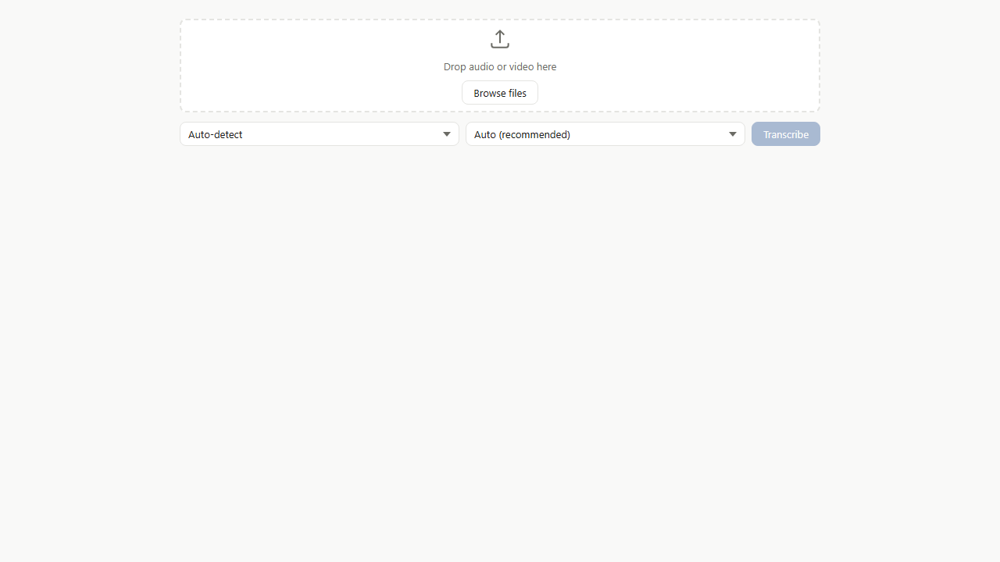
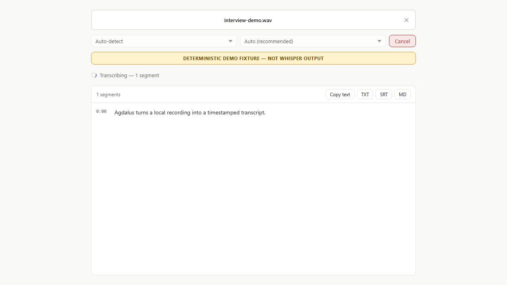
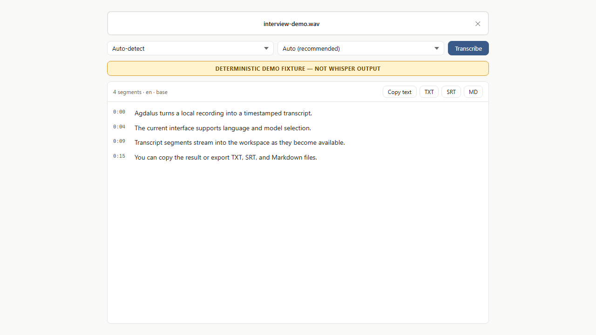

# Agdalus product demo package

This package supports a three-minute explainer video that shows the current
interface, demonstrates the evidenced upload/streaming lifecycle, and names the
remaining product gaps. It is designed for an engineering review, stakeholder
update, or design-partner preview. It is not a release video.

## Start here

1. Read the [feature and claim reference](FEATURE_REFERENCE.md).
2. Rehearse the [product video script](PRODUCT_VIDEO_SCRIPT.md).
3. Follow the [recording runbook](RECORDING_RUNBOOK.md).
4. Open [the evidence slide](evidence-slide.html) for the proof segment.

## Visual assets

### Idle desktop state

This is the browser-rendered current UI. It was captured at 1280 x 720 with no
console errors.

### Deterministic streaming state

The frontend is receiving NDJSON transcript events from
[`scripts/demo_fixture_backend.py`](../../scripts/demo_fixture_backend.py). The
fixture replaces FFmpeg and Whisper but retains real validation, bounded upload
persistence, streaming, and cleanup behavior.

### Completed transcript and exports

The completed state exposes timestamps, detected language, selected model, copy,
TXT, SRT, and Markdown actions. Export controls are implemented in the frontend;
golden export conformance and packaged desktop behavior remain future gates.

## Approved opening disclosure

> Development evidence demo. The transcript content is deterministic. FFmpeg,
> Whisper, and desktop packaging are not exercised in this recording.

Keep this disclosure visible for at least four seconds and repeat the boundary
when the transcript first appears.

## Related evidence

- [Loop 001 proof packet](../evidence/runs/2026-07-31-loop-001/PROOF_PACKET.md)
- [Fixture UAT report](../evidence/runs/2026-07-31-loop-001/UAT_REPORT.md)
- [Run manifest](../evidence/runs/2026-07-31-loop-001/RUN_MANIFEST.json)
- [Evaluation and promotion plan](../EVALUATION_PLAN.md)

## Verified rehearsal

The package was first rehearsed on 2026-07-31 and reverified before the tagged
cross-computer handoff:

- Vite returned the idle UI with a 46 ms browser load measurement.
- The deterministic fixture produced four streamed segments and a final event.
- The fixture request returned HTTP 200 through `127.0.0.1:54321`.
- The browser console reported no errors in idle, streaming, complete, or
  evidence-slide states.
- The captured browser trace used only local Vite resources and the loopback
  transcription request for the demonstrated flow.
- Ruff, Ruff format, Pyright, 26 backend tests, the 80% coverage gate, Svelte
  checks, and the Vite production build passed after the package was added.

This rehearsal validates the recording setup. It does not extend the claim
boundary described above.

The 24/24 value in the evidence slide is the historical, immutable Loop 001 run
recorded in its manifest. The current package verification has 26 tests because
it also executes the deterministic demo fixture contract.
